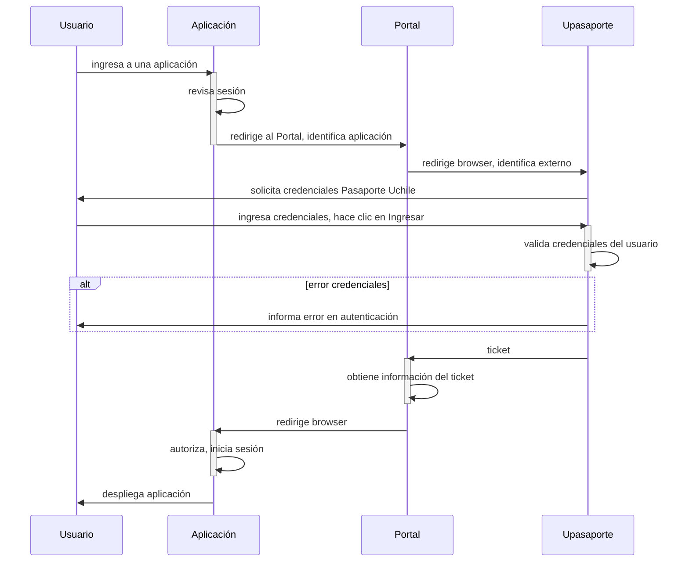

# Single-Sign On

Esta app provee autenticación utilizando cuenta Mi Uchile mediante el uso de Upasaporte del Centro Ucampus.

El app **SSO** (`_app/sso_`) en este proyecto provee un segundo mecanismo de autenticación para su proyecto. Funciona exponiendo el endpoint `https://<url||ip>/sso/login`, el cual es utilizado para comunicarse con el [**Portal DCC**](https://apps.dcc.uchile.cl/portal).

Este proyecto es un ejemplo de cómo integrar la autenticación del **`portal`** en un proyecto basado en Framework Django.

El flujo de autenticación para las aplicaciones que utilicen esta integración es el siguiente:



### Habilitación

Para integrar esta App en proyecto debe solicitar al Área de Tecnologías de Información del DCC <**desarrollo@dcc.uchile.cl**> la creación de su app indicando:

```dotenv
Nombre: (nombre de la app)
Descripción: (descripción corta de la aplicación, será mostrada a los usuarios en el Portal)
Endpoint: https://<url o ip>/sso/login
Responsable: (nombre de la persona responsable del proyecto)
Email: (debe proveer un correo @*.uchile.cl)
Ambiente: (desarrollo, produccion, localhost)
```

### Instalación

```python
# .env (proyecto)
...
DJANGO_SSO_APP=develop
DJANGO_SSO_AUTH=True
...
```

```python
# settings.py (proyecto)
...
INSTALLED_APPS = [
    "django.contrib.admin",
    "django.contrib.auth",
    "django.contrib.contenttypes",
    "django.contrib.sessions",
    "django.contrib.messages",
    "django.contrib.staticfiles",
    "sso.apps.SsoConfig",
]
...
LOGIN_URL=sso:index
SSO_URL=https://portal.dcc.uchile.cl/
SSO_APP=...
SSO_AUTH=...
...
```

```python
# urls.py (proyecto)
...
from sso.views import login

urlpatterns = [
    path("sso/", include("sso.urls")),
    path("admin/login/", login),
    path("admin/", admin.site.urls),
...
```

## Otros

- La documentación oficial del Portal: <https://github.com/DCC-FCFM-UCHILE/portal/tree/develop/doc>
- Diagramas de Secuencia: <https://mermaid-js.github.io/mermaid/#/sequenceDiagram>
- Actualmente GitHub no soporta el renderizado de mermaid, pero existe esta extensión: <https://github.com/BackMarket/github-mermaid-extension#install> (Chrome, Firefox, Opera)
